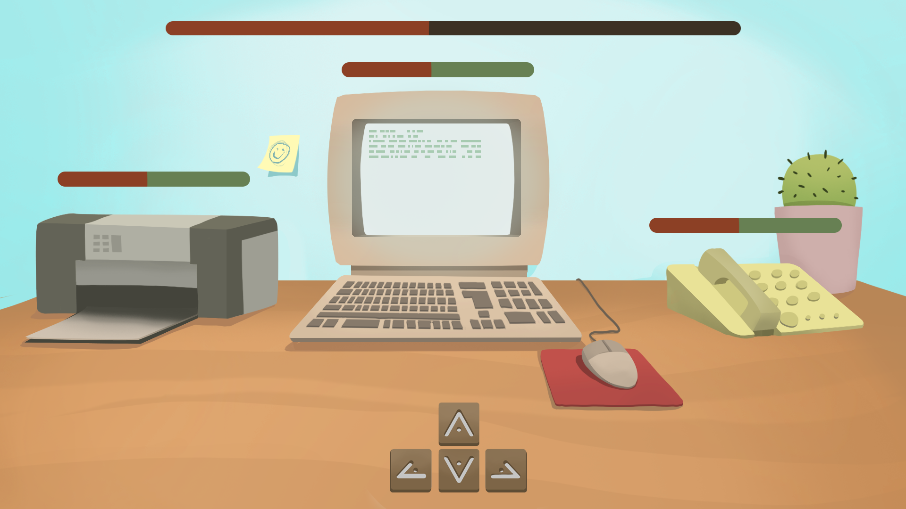

# Administrathor

Ability game developed for the Island Jam 3 / Ludum Dare #41.

## Background

You’re Viggo, a powerful, blood thirsty viking warrior who recently started working at an office. Take care of your workplace while dealing with the annoying paperplanes that travel through the office. And most importantly, try to control your rage!
Mechanics

You are sit in front of your desk. Computer, printer and telephone will claim your attention and you’ll have to click on them and follow the sequence of keys in order to keep them under control. While this happens, some paper airplane will also make you angry, so make sure you take care of them in time!

## Controls

* **Mouse click**: select object to repair / throw axe at paper airplane.
* **A, S, D, W**: repair object.

## Play online

[Click here to play Administrathor online](http://moisesjbc.github.io/games/administrathor/)

## Credits

Made for Island Jam III (Gran Canaria)

### Art

* Alicia Warhola 
* Luis Andrés Lara Zepeda

### Music

* Diego David Díaz Martín

### Programming

* Moisés J. Bonilla Caraballo

### Sounds

* Sounds adapted from <freesound.org>
